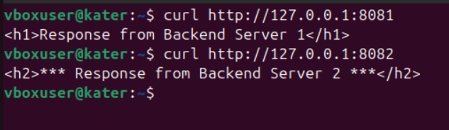
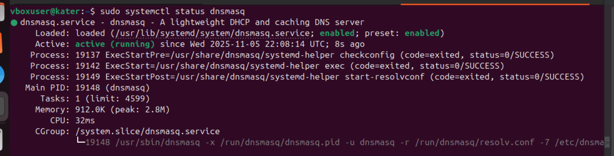
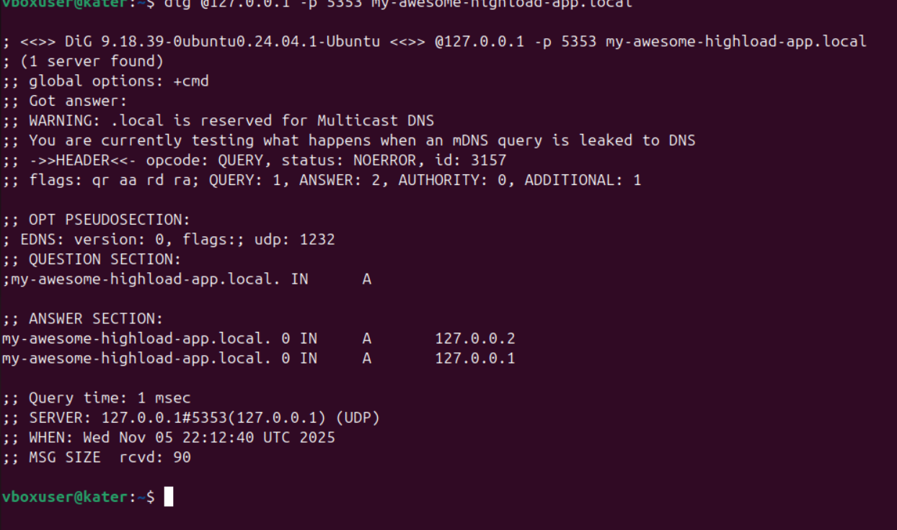
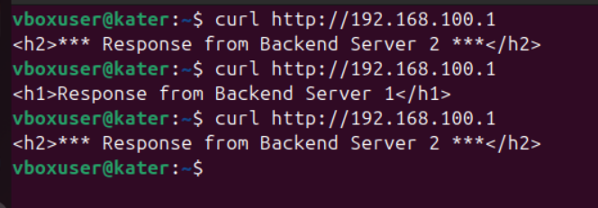
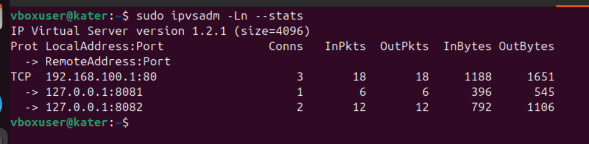
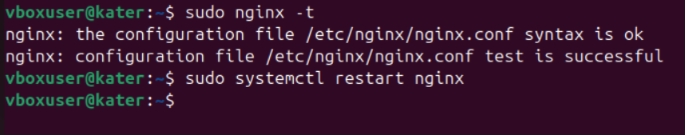
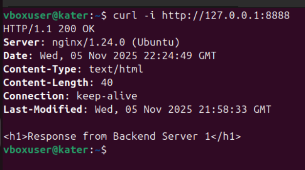
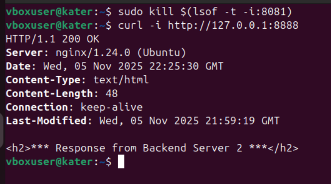
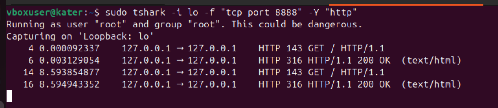

# highload_lab5_linux
## WEB. High Performance WEB и CDN

---

## Задание 1. Создание Server Pool для backend (10 баллов)

### Цель:
Создать два backend-сервера с простыми HTML-страницами и запустить их на разных портах.

### Шаг 1. Создание директорий
```bash
mkdir ~/backend1 ~/backend2
```

### Шаг 2. Создание index.html в каждом backend
**~/backend1/index.html**
```html
<h1>Response from Backend Server 1</h1>
```
**~/backend2/index.html**
```html
<h2>*** Response from Backend Server 2 ***</h2>
```

### Шаг 3. Запуск HTTP серверов
```bash
cd ~/backend1 && python3 -m http.server 8081 &
cd ~/backend2 && python3 -m http.server 8082 &
```


### Шаг 4. Проверка работы через curl
```bash
curl http://127.0.0.1:8081
curl http://127.0.0.1:8082
```
**Скриншот:**



---

## Задание 2. DNS Load Balancing с помощью dnsmasq (20 баллов)

### Шаг 1. Настройка конфигурации dnsmasq
```ini
listen-address=127.0.0.1
port=5353
address=/my-awesome-highload-app.local/127.0.0.1
address=/my-awesome-highload-app.local/127.0.0.2
```

### Шаг 2. Перезапуск dnsmasq
```bash
sudo systemctl restart dnsmasq
sudo systemctl status dnsmasq
```
**Скриншот:**



### Шаг 3. Проверка DNS-записи
```bash
dig @127.0.0.1 -p 5353 my-awesome-highload-app.local
```
**Скриншот:**



### Анализ:
DNS возвращает две A-записи. При падении backend2 DNS-записи не изменятся — dnsmasq не проверяет состояние серверов.

---

## Задание 3. Балансировка Layer 4 с помощью IPVS (35 баллов)

### Шаг 1. Создание dummy-интерфейса
```bash
sudo ip link add dummy1 type dummy
sudo ip addr add 192.168.100.1/32 dev dummy1
sudo ip link set dummy1 up
```

### Шаг 2. Настройка виртуального сервера IPVS
```bash
sudo ipvsadm -A -t 192.168.100.1:80 -s rr
sudo ipvsadm -a -t 192.168.100.1:80 -r 127.0.0.1:8081 -m
sudo ipvsadm -a -t 192.168.100.1:80 -r 127.0.0.1:8082 -m
```

### Шаг 3. Проверка работы балансировщика
```bash
curl http://192.168.100.1
curl http://192.168.100.1
curl http://192.168.100.1
```
**Скриншот:**



### Шаг 4. Проверка статистики
```bash
sudo ipvsadm -Ln --stats
```
**Скриншот:**



---

## Задание 4. Балансировка L7 с помощью NGINX (35 баллов)

### Шаг 1. Конфигурация NGINX
```nginx
upstream backend_pool {
server 127.0.0.1:8081 max_fails=7 fail_timeout=10s;
server 127.0.0.1:8082 backup;
}

server {
listen 127.0.0.1:8888;
location / {
proxy_set_header X-high-load-test "123";
proxy_pass http://backend_pool;
}
}
```

### Шаг 2. Проверка конфигурации и перезапуск
```bash
sudo nginx -t
sudo systemctl restart nginx
```
**Скриншот:**



### Шаг 3. Проверка работы активного сервера
```bash
curl -i http://127.0.0.1:8888
```
**Скриншот:**



### Шаг 4. Имитация отказа активного backend
```bash
sudo kill $(lsof -t -i:8081)
curl -i http://127.0.0.1:8888
```
**Скриншот:**



### Шаг 5. Проверка HTTP-заголовков через tshark
```bash
sudo tshark -i lo -f "tcp port 8888" -Y "http"
```
**Скриншот:**


